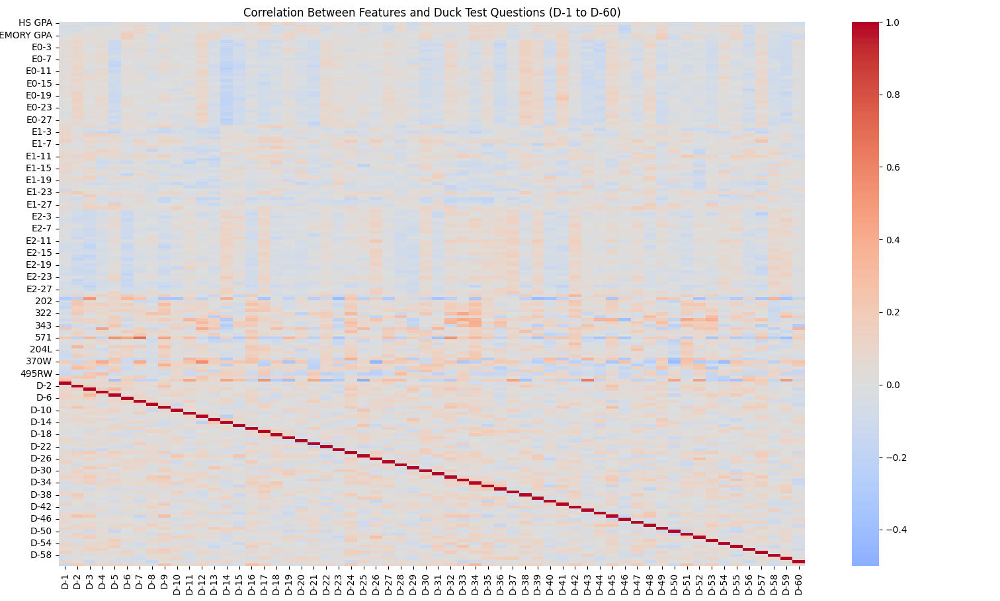
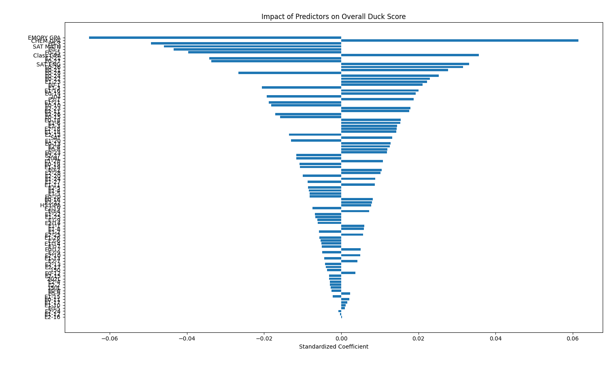
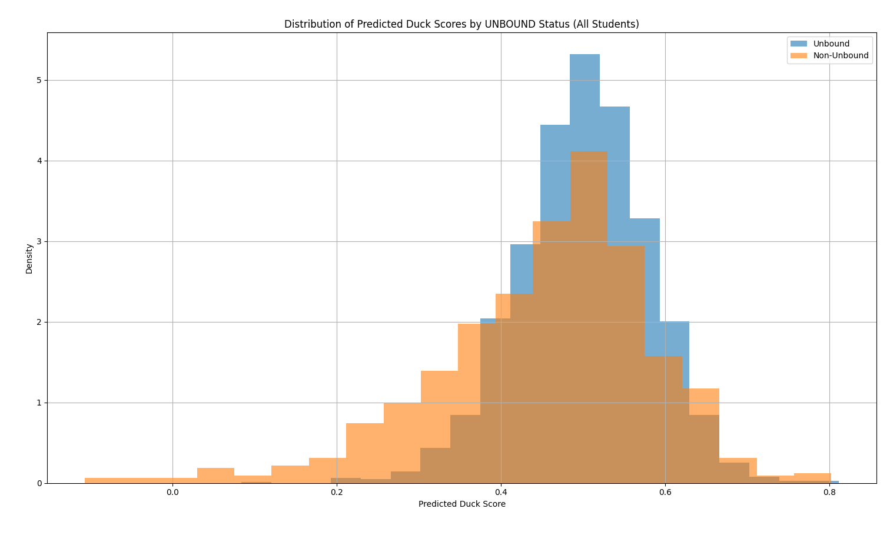

# Chemistry Unbound DUCK Score Prediction

This project uses machine learning to predict students' final chemistry exam performance (DUCK scores) based on earlier academic and demographic features, specifically within the context of Emory University's Chemistry Unbound program.

---

## 📊 Project Overview

The goal was to predict student performance on the **DUCK exam** (Diagnostic Understanding of Chemistry Knowledge) using:

- Early placement exam scores (`E0`, `E1`, `E2`)
- GPA data (High School, Emory College, Chemistry GPA)
- Standardized test scores (SAT Math, SAT English)
- Individual chemistry course grades

This enables early identification of students at risk and helps in providing targeted support.

---

## 📁 Project Structure

```
Chemistry-Score-Predictor/
├── data/                  # Raw and processed datasets
├── notebooks/             # Jupyter notebooks for EDA and modeling
├── models/                # Trained models
├── src/                   # Scripts for training and analysis
├── README.md              # Project documentation (this file)
```

---

## 🔍 Features Used

- **Early Chemistry Exams:** `E0`, `E1`, `E2` scores.
- **Course Grades:** Converted to GPA scale for all chemistry-related courses.
- **Demographic/Academic Info:** SAT scores, HS GPA, Emory GPA, Chemistry GPA.
- **DUCK Scores:** Individual item responses (D-1 to D-60).

---

## 🧠 Models

- **Linear Regression**
- **Random Forest Regressor**
- **Gradient Boosting Regressor**
- **Neural Networks**

Model selection was based on cross-validation accuracy for predicting per-question DUCK responses.

---

## 🚀 Getting Started

1. Clone the repository:
   ```bash
   git clone https://github.com/your-username/Chemistry-Score-Predictor.git
   cd Chemistry-Score-Predictor
   ```

2. Install the dependencies:
   ```bash
   pip install -r requirements.txt
   ```

3. Run the main analysis:
   ```bash
   python src/data_analysis.py
   ```

---

## 🧪 Testing & Evaluation

The project included:

- Comparison of actual and predicted DUCK scores
- Correlation heatmaps between features and DUCK items
- Regression analysis identifying strongest predictors
- Statistical comparisons between Unbound and Non-Unbound students

### 📈 Key Results

| Metric | Value |
|:---|:---|
| **Training set size** | 223 students |
| **Duck score training mean** | 0.523 |
| **Total students predicted** | 2866 |
| **Unbound students** | 2154 |
| **Non-Unbound students** | 712 |
| **Mean predicted duck score (Unbound)** | 0.50 |
| **Mean predicted duck score (Non-Unbound)** | 0.45 |

---

## 📊 Figures

### 1. Average DUCK Scores per Question


---

### 2. Correlation Heatmap Between Features and DUCK Questions



---

### 3. Impact of Predictors on Overall DUCK Score



---

### 4. Distribution of Predicted DUCK Scores by Group



---

## 📋 Methodology Summary

- **Data Preprocessing:** Missing values imputed, grades converted to GPA equivalents, numerical standardization.
- **Modeling:** Multi-output prediction of DUCK responses; cross-validated Random Forest, XGBoost, and Neural Networks.
- **Evaluation:** T-tests, confidence intervals, and Cohen’s d effect size were used to assess significance of differences.

Methodology and results are documented in project files.

---

## 👩‍🔬 Author

Aditya Dutta

---

## 📄 License

This project is licensed under the MIT License.